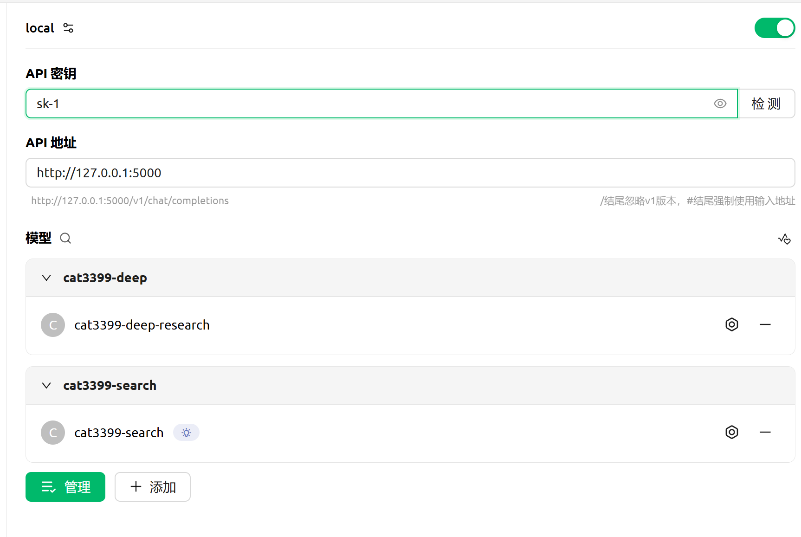

[简体中文](README.md) | English

---

# DeepResearch

This project is a Python-based, AI-driven solution for intelligent search and in-depth research. It aims to help users obtain high-quality, highly relevant materials from vast amounts of information through a well-designed Agent architecture and precise search strategies.

> **Core Philosophy:** The quality of research materials is far more valuable than a list of hundreds of web pages.

## ✨ Key Features

*   **Fully Local Deployment**: All services used can be deployed locally. Apart from the LLM API, it does not depend on any online services.
*   **Visualized Research Process**: The entire research process is completely transparent. It "live-streams" every step of the AI's process in real-time, from initial planning and dynamic searching to webpage evaluation and iterative deepening.
*   **OpenAI-Compatible API Service**: Built on Flask, it provides an API interface compliant with the OpenAI format.
*   **Webpage Content Compression**: Utilizes large models to compress webpage content, reducing context length and increasing the density of effective information. This allows for accessing more webpages within the same context window.
*   **Multi-LLM Collaboration**: Fully leverages the capabilities of various models to collaboratively complete the entire task.
*   **Controllable Process**: Users can control aspects like search language and source restrictions through prompts.
*   **Sophisticated Prompt Engineering**: Features a large number of meticulously designed prompts and message handling processes to guide the LLM through complex tasks like search planning, information evaluation, and content generation. In tests using only the Gemini 2.5 Flash model, it has run dozens of times without any errors.

## Table of Contents
- [✨ Key Features](#-key-features)
- [🏗️ System Architecture](#️-system-architecture)
- [🚀 Quick Start](#-quick-start)
  - [Method 1: Using Docker (Recommended)](#method-1-using-docker-recommended)
  - [Method 2: Local Deployment](#method-2-local-deployment)
- [🧩 External Service Dependencies](#-external-service-dependencies)
- [🛠️ API Usage Example](#️-api-usage-example)
- [📦 Python Library Dependencies](#-python-library-dependencies)
- [💡 Showcase](#-showcase)
  - [Summarization Tasks](#summarization-tasks)
  - [Niche Questions](#niche-questions)
- [🤔 Known Issues](#-known-issues)
- [✍️ TODO](#️-todo)
- [🤝 Contributing](#-contributing)
- [📄 License](#-license)
- [Star History](#star-history)

## 🏗️ System Architecture


## 🚀 Quick Start

We offer two deployment methods: using Docker (recommended) or running directly in your local environment.

### **Method 1: Using Docker (Recommended)**

This is the simplest and most recommended deployment method, as it doesn't require manual management of Python environments and dependencies. The project root directory already contains `Dockerfile` and `docker-compose.yml` files.

#### Launching the Service

You can use either Docker Compose or the Docker CLI to start the service.

**A. Using Docker Compose (Recommended)**

The project root directory includes a `docker-compose.yml` file with the following content:

```yaml
version: '3'

services:
  deepresearch:
    container_name: deepresearch
    image: cat3399/deepresearch:latest
    ports:
      - "5000:5000"
    # volumes:
    #   - ./.env:/app/.env # If you want to use a local .env file, please uncomment this line
```

Run the following command in the project root directory to start the service:

```bash
docker-compose up -d
```
> **Note**: The `volumes` section in the `docker-compose.yml` file is commented out by default. If you wish to map your local `.env` file directly into the container (recommended practice), please **uncomment that line** before running the command.

**B. Using Docker CLI**

If you don't use Docker Compose, you can also run the Docker container directly with the following command:

```bash
docker run -d --name deepresearch -p 5000:5000 cat3399/deepresearch:latest
```

#### **3. Accessing the Service**
Once the service is running, you can access the API service at `http://127.0.0.1:5000` or the visual configuration page at `http://127.0.0.1:5000/setting`.

---

### **Method 2: Local Deployment**

#### **1. Prerequisites**

*   Ensure you have Python 3.8+ installed.
*   It is recommended to use a virtual environment like `uv` or `venv`.

#### **2. Install Dependencies**

After cloning this repository to your local machine, run the following command in the project root directory:

```bash
pip install -r requirements.txt
```

#### **3. Configure Environment Variables**

> You can use a browser to access `http://127.0.0.1:5000/setting` for a web-based configuration UI.
> Saved configurations take effect immediately without needing to restart the service.

**A. Quick Setup (Using only Gemini)**

This is the simplest configuration method. If you only want to use the Gemini API, follow these steps.

*   Copy the `.env.template` file and rename it to `.env`:
```bash
cp .env.template .env
```
*   **The only step required**: Just fill in the `ALL_IN_GEMINI_KEY` in the configuration file.
*   **Multi-Key Support**: You can enter multiple Gemini API Keys, separated by a comma `,`.
> With this configuration, the base and summary models will use Gemini 2.5 Pro, the evaluation model will use 2.5 Flash, and the compression model will use 2.5 Flash Lite. Specific model configurations will override these defaults.
---

**B. Full Configuration (For all models)**
*   Copy the `.env.template` file and rename it to `.env`:
```bash
cp .env.template .env
```
*   Fill in the necessary API keys and URLs in the `.env` file according to your setup.

> **General Instructions**:
> *   All `API_KEY` fields support multiple keys separated by a comma `,`. The program will randomly select one to use.
> *   For all models except the content compression model, if you leave the specific model's configuration items (e.g., `SEARCH_KEYWORD_API_KEY`, `SEARCH_KEYWORD_API_URL`) blank, the system will default to using the `BASE_CHAT_*` configuration.
> *   The `API_TYPE` field specifies the API format. If left blank, it defaults to the `OPENAI` format. Except for the content compression model, other models do not currently support the native Gemini format (Gemini has an OpenAI compatibility mode: [OpenAI compatibility | Gemini API | Google AI for Developers](https://ai.google.dev/gemini-api/docs/openai?hl=en)).

Here is a detailed explanation of the key configuration items:

#### **Base Configuration**
*   `API_KEY`: The authorization key required to access this project's API service.

#### **Search Engine Configuration**
> `SearXNG` is used by default. If a `SearXNG` request fails, it will automatically switch to `Tavily`.

* `SEARXNG_URL`: Your self-hosted or a public SearXNG instance. **Must support JSON format output**.

* `TAVILY_KEY`: API key for the Tavily service.

* `TAVILY_MAX_NUM`: The maximum number of results to return when using Tavily search. `20` is recommended.

  > `SEARCH_API_LIMIT`: Limits the number of concurrent requests to the search engine API. Please set this according to your service provider's limits.

#### **Web Scraper Configuration (Configure at least one)**
> If all are configured, the priority is FireCrawl > Crawl4ai > Jina.

* `FIRECRAWL_API_URL`: URL for the FireCrawl service. Can be left blank if using the official API.

* `FIRECRAWL_API_KEY`: API key for the FireCrawl service. Can be left blank for local deployments if no key is set, but must be filled for the official API.

* `CRAWL4AI_API_URL`: URL for the Crawl4AI service.

* `JINA_API_URL`: URL for the Jina service (official free tier available, see https://jina.ai/reader/).

* `JINA_API_KEY`: API key for the Jina service.

#### **Search and Research Parameters**
*   `CRAWL_THREAD_NUM`: Number of concurrent tasks for crawling web pages. It's recommended to lower this value based on your network and server performance to improve success rates (e.g., the official FireCrawl free tier is limited to 10 requests/minute).
*   `MAX_SEARCH_RESULTS`: The maximum number of web pages to process in a single search in normal search mode.
*   `MAX_DEEPRESEARCH_RESULTS`: The maximum number of web pages to process in each iteration in deep research mode. It's not recommended to set this too high; `3` is suggested.
*   `MAX_STEPS_NUM`: The maximum number of iterations in deep research mode. `12` is suggested.

#### **Large Language Model (LLM) Configuration**

*   **Base Chat Model (Required)**
    > Used for handling user interactions and tool calls. **The model must support Function Calling**.
    *   `BASE_CHAT_API_KEY`: API key.
    *   `BASE_CHAT_API_URL`: API endpoint URL.
    *   `BASE_CHAT_MODEL`: Model name.

*   **Search Keyword Generation Model (Required)**
    *   `SEARCH_KEYWORD_API_KEY`, `SEARCH_KEYWORD_API_URL`, `SEARCH_KEYWORD_MODEL`
    > It is best to use a high-performance model with long-context capabilities for `SEARCH_KEYWORD_MODEL`.

*   **Search Result Evaluation Model (Required)**
    *   `EVALUATE_THREAD_NUM`: Number of concurrent tasks for evaluating the value of web pages.
    *   `EVALUATE_API_KEY`, `EVALUATE_API_URL`, `EVALUATE_MODEL`

*   **Webpage Content Compression Model (Required)**
    > It is recommended to choose a model that supports long context and has a fast response time.
    *   `COMPRESS_API_TYPE`: Specify the API format, e.g., `GEMINI` or `OPENAI`.
    *   `COMPRESS_API_KEY`: API key. If using Gemini, it's recommended to provide at least two keys to avoid rate limiting issues.
    *   `COMPRESS_API_URL`: API endpoint URL.
    *   `COMPRESS_MODEL`: Model name.

*   **Final Summary Generation Model (Required)**
    *   `SUMMARY_API_TYPE`, `SUMMARY_API_KEY`, `SUMMARY_API_URL`, `SUMMARY_MODEL`

#### **4. Run the Service**

To test if all APIs are working correctly:
```
python main.py --test
```

In the project root directory, run:

```bash
python main.py
```

The service will start by default at `http://0.0.0.0:5000`.

## 🧩 External Service Dependencies

**Search Engine API (Choose one)**:

*   **Searxng**: [Self-host](https://docs.searxng.org/admin/installation-docker.html) or use [public instances](https://searx.space/). JSON format support is required.
*   **Tavily**: [Tavily Website](https://www.tavily.com/)

**Web Scraper (Choose one)**:

*   **FireCrawl**: [Self-host](https://docs.firecrawl.dev/contributing/self-host#docker-containers-fail-to-start) or use the [official API](https://firecrawl.dev).
*   **Crawl4AI**: [Self-host](https://docs.crawl4ai.com/core/docker-deployment/).
*   **Jina**: [Official free API](https://jina.ai/reader/) or [self-host](https://github.com/intergalacticalvariable/reader).

**LLM**: An API provider for large language models.

## 🛠️ API Usage Example

You can interact with the service using any client compatible with the OpenAI API format (such as LobeChat, One-API, OpenWebui, Cherry Studio).

Example with Cherry Studio:



> **Tip**: To trigger the deep research mode, use a model ID that includes `deep-research`. The list of supported model IDs can be obtained from the `/v1/models` endpoint.

## 📦 Python Library Dependencies

*   **Flask**: Web framework.
*   **OpenAI Python SDK**: For interacting with OpenAI-compatible APIs.
*   **Requests**: HTTP request library.
*   **BeautifulSoup4**: HTML/XML parsing.
*   **PyMuPDF, python-docx, openpyxl**: For parsing PDF, DOCX, XLSX files.
*   **python-dotenv**: Loading environment variables.

For the complete list of dependencies, please see `requirements.txt`.

## 💡 Showcase

### Summarization Tasks
> Prompt: Get the parameters and official API prices for all conversational models from Gemini, Claude, DeepSeek, GLM, and Qwen. Present the data clearly in a table. I need very complete data, and please don't omit anything in the final summary.

> Result from this project (All models used are Gemini 2.5 Flash, except for the final summary which used Gemini 2.5 Pro)


> Result from OpenAI's free Deepresearch (Contributions of results from the paid version are welcome)
>
> [View full conversation](https://chatgpt.com/share/6856adee-76ec-8004-a601-132d43ed1dab)


### Niche Questions
> Prompt: How to use KVM acceleration with QEMU for rk3399 under Linux?

> Regarding "RK3399 QEMU enable KVM," the key is the big.LITTLE architecture. **You need to use `taskset` to bind cores**.


> Result from OpenAI's free Deepresearch


## 🤔 Known Issues
*   Prematurely ending research - Include keywords like "detailed research" in your request to mitigate this.

## ✍️ TODO

*   More robust project management.
*   Refactor using asyncio to prevent timeouts and enhance concurrency.
*   Improved architectural design (the current sequential iteration is not suitable for all tasks).
*   Intelligently extract URLs from webpage content.
*   Support for follow-up questions.

## 🤝 Contributing

Contributions are welcome! Please feel free to improve this project by submitting Pull Requests or creating Issues. Every contribution is highly valued!

## 📄 License

This project is licensed under the [Creative Commons Attribution-NonCommercial-ShareAlike 4.0 International (CC BY-NC-SA 4.0) License](http://creativecommons.org/licenses/by-nc-sa/4.0/).

In simple terms, this means:

*   **You are free to**:
    *   **Share** — copy and redistribute the material in any medium or format.
    *   **Adapt** — remix, transform, and build upon the material.
*   **Under the following conditions**:
    *   **Attribution** — You must give appropriate credit, provide a link to the license, and indicate if changes were made.
    *   **NonCommercial** — You may not use the material for commercial purposes.
    *   **ShareAlike** — If you remix, transform, or build upon the material, you must distribute your contributions under the same license as the original.

> If you wish to use this project for commercial purposes, please contact the author to obtain a commercial license.

## Star History

[](https://star-history.com/#cat3399/deepresearch&Date)